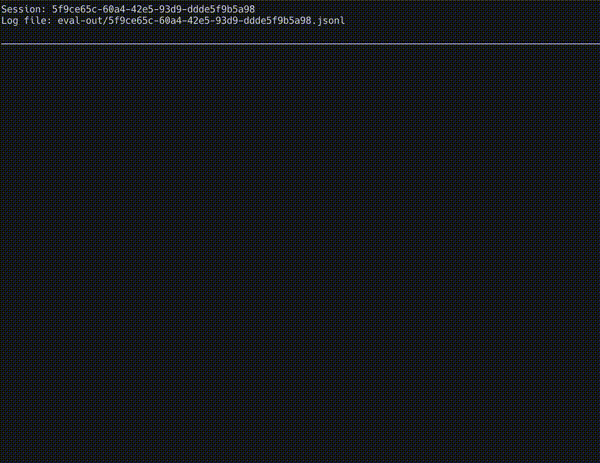

# gom-jabbar

A ruthless LLM testing framework that separates human-like responses from animal reflexes.



`gom-jabbar` is a testing framework built for use with the vercel ai-sdk. It is designed to help you validate your LLM's true capabilities through rigorous testing. It is a general eval harness, but written in a unit-test style with a specific focus on making evaluating tool-use easier.

Just as the Bene Gesserit's gom jabbar separates the conscious from the instinctive, this framework helps you validate your LLM's true capabilities through rigorous testing.

## Features

- Unit test-style syntax for LLM evaluations
- First-class support for tool-call testing
- Flexible assertion system for validating LLM responses
- Structured reporting and analytics
- Easy integration with existing LLM projects

## Installation

`gom-jabbar` is not yet available on npm (coming soon!). You can install it directly from the source:

```bash
yarn add https://github.com/mentat-ai/gom-jabbar.git
```

## Quick Start

```typescript
// evals.ts
import { cli, expectSingleToolCall, TestSuiteBuilder } from 'gom-jabbar'
import { tool } from 'ai'
import { z } from 'zod'
import { expect } from 'expect'
import { openai } from '@ai-sdk/openai'
import { anthropic } from '@ai-sdk/anthropic'

// Typically, you would import your tools from elsewhere in your codebase,
// but for this example, we'll just define them here. Ideally you should
// use the exact same tools for your evals that you use in your production
// code.
const tools = {
  add: tool({
    description: 'A tool that can add two numbers',
    parameters: z.object({
      lhs: z.number(),
      rhs: z.number(),
    }),
    execute: async ({ lhs, rhs }) => {
      // In this case, the code here doesnt matter because gom-jabbar
      // never executes your tools during evaluation.
      return lhs + rhs
    },
  }),
}

// Your test suite builder is initialized with your tools, system prompt,
// and models. Define all the models you want to evaluate here.
const suite = new TestSuiteBuilder({
  tools,
  systemPrompt:
    'You are a helpful assistant that can use tools to answer questions.',
  models: {
    // It is considered a best practice to use exact model versions for evals
    // so that you can pinpoint regressions easier. These models can also be imported
    // from your application code, including middleware!
    o1: openai('o1-2024-12-17'),
    gpt4o: openai('gpt-4o-2024-08-06'),
    haiku: anthropic('claude-3-haiku-20240307'),
    sonnet: anthropic('claude-3-5-sonnet-20240620'),
  },
})

suite.eval('What is 2 + 4?', async ({ result }) => {
  const toolParams = expectSingleToolCall(result, 'add')
  // `toolParams` is strongly typed based on the tool definition
  // and you can use expect to assert dynamic properties.
  expect(toolParams.lhs).toBe(2)
  expect(toolParams.rhs).toBe(4)
})

// Finally, you can build your test suite and run the cli.
// Now you can run a benchmark by calling this file with the benchmark command.
cli(suite.build())
```

Then run `tsx evals.ts benchmark` to see the output. Specific results are saved to a log file each session
and can be viewed using the web-inspector (coming soon!).

## Examples

You can see more examples in the [examples directory](examples):

- [Basic](examples/basic.ts) the example above
- [Comprehensive](examples/comprehensive.ts) this demonstrates all the features of the framework

## Why gom-jabbar?

This is part of a large dune-themed project and the name `gom-jabbar` was almost too perfect:

- It's literally a test of humanity in Dune
- You're testing LLMs' ability to use tools in a "human-like" way
- The gom jabbar test is specifically about control and precision in responses - exactly what you want from LLM tool usage
- The Bene Gesserit use it as a key discriminator - and this framework similarly helps you discriminate between good and bad models, settings and prompts

---

Part of the Mentat Project
